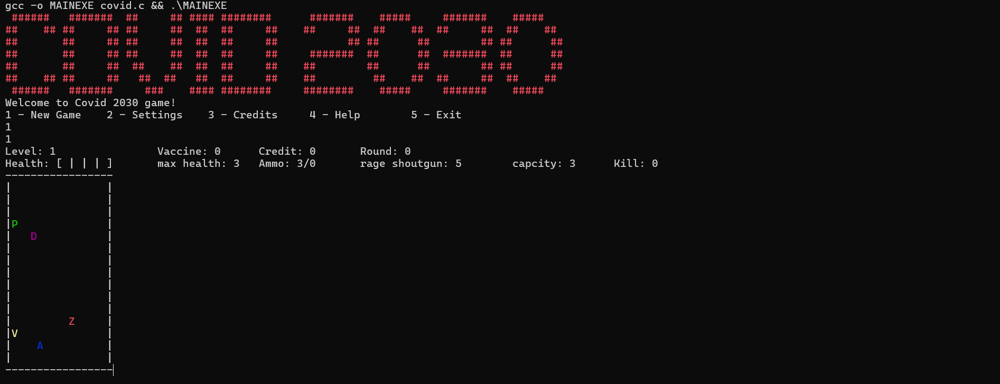

# Covid 2030 🧟‍♂️💉

A terminal-based survival shooter written in plain C. Dodge zombies, gather vaccines and ammo on an ASCII radar map, and get back to the extraction point before your health hits zero.

Built as the practical project for the **Fundamentals of Programming** course (Fall 1402) at Iran University of Science and Technology.

 

## Story

It's 2030, and COVID has pushed humanity to the brink. A team of scientists is sent to a Mars space station (ISSM) to develop a definitive vaccine in isolation — but an accident during production turns the entire team into zombies. You're part of the rescue team sent from Earth: land on Mars, survive among the infected, collect every vaccine sample scattered across the surface, and reach the extraction point to bring them home.

## Screenshot



*(add your own screenshot to `docs/screenshot.png` — or update the path above — to have it show up here)*

## Features

- Main menu with **New Game**, **Settings**, **Credits**, **Help**, and **Exit**
- ASCII radar map (15×15) with colorized entities: your character, zombies, vaccines, ammo drops, and the extraction point
- Health, ammo, credit, round, level, and kill-count HUD
- Shotgun combat with magazine + reserve ammo and a `reload` action
- Zombies that path toward you (horizontal movement prioritized) and only move every other round
- A credit system earned by collecting vaccines and killing zombies
- An in-game **upgrade shop**: bigger magazine, longer shotgun range, extra health
- A full kill-streak callout system (`First Blood` → `Godlike`, 14 tiers)
- Level progression: each level scales up the number of zombies, vaccines, and ammo drops
- An in-game pause/menu overlay (`m`) to restart, jump into settings, or exit without quitting the process

## Requirements

- A C compiler (GCC recommended)
- A terminal that supports ANSI color escape codes
- `unistd.h` availability (standard on Linux/macOS; on Windows, build with MinGW-w64 or run inside WSL — MSVC's `cl.exe` will not compile this as-is)

## Build & Run

```bash
gcc -o covid COVID.c
./covid
```

On Windows (MinGW/Git Bash):

```bash
gcc -o covid.exe COVID.c
./covid.exe
```

## How to Play

### Main menu

| Option | Action |
|---|---|
| `1` | New Game |
| `2` | Settings (view/change level and sound state) |
| `3` | Credits |
| `4` | Help |
| `5` | Exit |

### In-game controls

**Move**

| Up | Down | Left | Right |
|---|---|---|---|
| `w` | `s` | `a` | `d` |

**Shoot**

| Up | Down | Left | Right |
|---|---|---|---|
| `t` | `g` | `h` | `f` |

**Other actions**

| Key | Action |
|---|---|
| `r` | Reload the magazine from reserve ammo |
| `u` | Open the upgrade menu |
| `m` | Open the pause/game menu (new game, settings, exit) |
| `e` | Quit (with confirmation) |

Every keypress — valid or not — advances the round counter, and zombies take their turn on even rounds.

### Radar legend

| Symbol | Meaning |
|---|---|
| `P` | You (the player) |
| `Z` | Zombie |
| `V` | Vaccine |
| `A` | Ammo pickup |
| `D` | Extraction / data-sync point — reach it once all vaccines on the level are collected to advance |

### HUD

```
Level: 1   Vaccine: 0   Credit: 0   Round: 0
Health: [ | | | ]   max health: 3   Ammo: 3/0   rage shoutgun: 5   capcity: 3   Kill: 0
```

- **Health** — number of `|` marks left; hitting 0 ends the run
- **Ammo** — `loaded/reserve`; use `r` to reload from reserve into the magazine
- **Credit** — earned from vaccine pickups and zombie kills, spent in the upgrade menu
- **Round** — increments on every input

### Upgrades (`u`)

| # | Upgrade | Cost |
|---|---|---|
| 1 | +1 magazine capacity (max 12) | `capacity × level` |
| 2 | +1 shotgun range | `range + level` |
| 3 | +1 max health (max 8) | `health × (level + 1)` |

### Kill streaks

Every kill prints a callout based on your running kill count (mod 14): `First Blood`, `Double Kill`, `Triple Kill`/`Hattrick`, `Team Killer`, `Headshot`, `Rampage`, `Killing Spree`, `Unstoppable`, `Monster Kill`, `Multi Kill`, `Ludicrous Kill`, `Ultra Kill`, `Dominating`, `Godlike`.

## Project structure

```
.
├── COVID.c                    # entire game (single-file implementation)
└── Doc COVID 2030 FCP.pdf     # original course assignment / spec (Persian)
```

## Known limitations

This started as a course assignment, so a few rough edges are still in the code:

- Some numeric caps (e.g. max magazine/health) were tuned differently from the original spec's suggested values
- A handful of edge cases around simultaneous item spawns and reload timing are still being refined
- Sound playback and the `Clear_scr`/timed-pause helpers described in the assignment brief aren't wired in yet

Contributions and bug reports are welcome.

## Credits

Made by **Matin Hasanali Baki** ([@MatinHAB05](https://github.com/MatinHAB05)).
